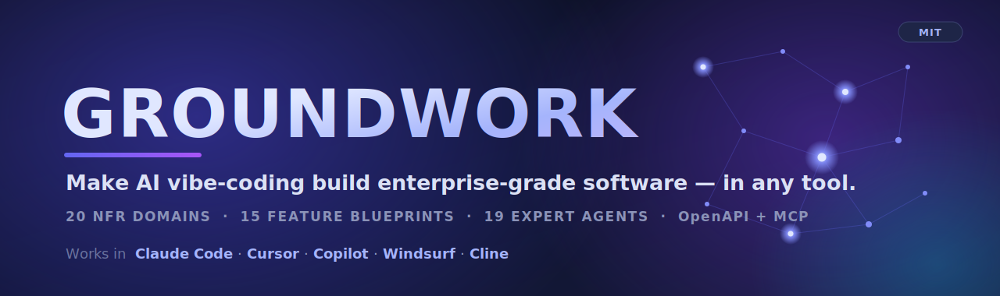

<p align="center">
  
</p>

# Groundwork

**An enterprise-grade knowledge base + agent library that makes AI "vibe coding" produce production-ready software — in any AI coding tool.**

 &nbsp;·&nbsp; Works with **Claude Code · Cursor · GitHub Copilot · Windsurf · Cline / Roo**

You describe features in plain English; your AI assistant reads Groundwork *first* and builds to an enterprise standard automatically — multi-tenancy, security, audit logging, compliance, performance, accessibility, and clean architecture, baked in from line one.

> 📖 New here? The **[full tutorial](TUTORIAL.md)** walks you through install, per-tool setup, what to keep/drop, and the daily workflow.

---

## ⚡ Quick install

```bash
# 1) Get it into your project as a folder named `groundwork/`
npx degit ai-code-factory-hub/ai-coding-standards groundwork
#   (or) git clone https://github.com/ai-code-factory-hub/ai-coding-standards.git groundwork
#   (or) download the ZIP from the green "Code" button

# 2) Turn it on in your tool (copy ONE rules file):
#   Claude Code → point your project CLAUDE.md at groundwork/ (or copy groundwork/AGENTS.md to root)
cp groundwork/tool-configs/cursor.mdc               .cursor/rules/groundwork.mdc      # Cursor
cp groundwork/tool-configs/copilot-instructions.md  .github/copilot-instructions.md   # Copilot
cp groundwork/tool-configs/windsurfrules.md         .windsurfrules                    # Windsurf
cp groundwork/tool-configs/clinerules.md            .clinerules                       # Cline / Roo

# 3) Verify — ask your assistant:
#   "What does groundwork/standards-kb say about multi-tenancy?"
#   If it answers from the files (RLS, tenant_id…), you're live.
```

---

## Why it exists

Vibe coding is fast but drifts: the AI guesses architecture, forgets tenancy and audit trails, and builds every feature differently. Groundwork is the **rulebook the AI reads before it writes code**.

| Without Groundwork | With Groundwork |
|---|---|
| AI guesses architecture, asks endless questions, drifts | Reads locked standards → no guessing, no drift |
| Every feature built differently | Every feature inherits the same bar (security, tenancy, audit, a11y) |
| "Build a report screen" → generic CRUD | Adapts the `report-builder` blueprint → governed, complete |
| Compliance & logging bolted on later | GDPR/DPDP, audit taxonomy, RBAC baked in from line 1 |
| Re-explain your standards every project | Copy the folder → only write new requirements |
| "Act senior" is a hope | Invoke a real role: Architect, Security Officer, QA… |

**The core idea:** it converts vibe coding from *"I hope the AI does it right"* into *"the AI is bound to my enterprise standard."*

---

## 📚 The Knowledge Bases

Each folder is knowledge the AI pulls **on demand** — only the 2–3 files relevant to your task, so it stays fast.

| KB | What it covers | How it helps your project |
|---|---|---|
| **`standards-kb/`** | 20 NFR domains (01–20) + master release gate | The **bar** every feature must meet — consistent, enterprise-grade output every time |
| **`feature-blueprints/`** | 15 buildable feature specs | Build common features (billing, RBAC, reports, workflow engine…) fast and correctly |
| **`admin-kb/`** | The full Admin Area — 13 surfaces | Your admin panel (logs, security center, consent/DSR, API analytics) is never an afterthought |
| **`design-system-kb/`** | Design tokens + theming (light/dark, white-label) | Consistent, themeable, accessible UI — no hardcoded colors |
| **`component-library-kb/`** | 36-component catalog + React/Tailwind recipes | Don't reinvent buttons, tables, modals — reuse tested patterns |
| **`api-kb/`** | OpenAPI spec-first: design, security, gateway, access analytics, SDKs | Safe, well-governed APIs others can integrate with |
| **`mcp-kb/`** | Expose your app to AI agents via a secure MCP server | Make your product AI-agent-connectable, safely |
| **`events-kb/`** | Async patterns: outbox, saga, pub/sub, idempotent consumers | Reliable event-driven architecture, no lost/duplicate messages |
| **`performance-kb/`** | Pooling, query/statement, code-level & frontend perf, profiling | Fast, scalable code with budgets enforced in CI |
| **`sre-kb/`** | Incident response, SLOs/error budgets, on-call + 8 runbooks | Operable in production — turn 2am panic into a checklist |
| **`compliance-kb/`** | GDPR · DPDP · CCPA · SOC2 · ISO 27001 · PCI · HIPAA + controls matrix | Regulator-ready; do-it-once controls satisfy many regimes |
| **`threat-models/`** | STRIDE method + 8 per-feature threat models | Security designed in, per feature type (auth, upload, payment, AI…) |
| **`finops-kb/`** | Per-tenant cost model, unit economics, cost allocation | Know if a customer is actually profitable |
| **`data-kb/`** | Governed analytics data layer + SaaS metric/churn definitions | Trustworthy reporting & the backbone for the report builder |
| **`engineering-doctrine/`** | Lean Code Doctrine (YAGNI) + anti-duplication/refactoring | Keeps the codebase minimal — no speculative bloat |
| **`templates/`** | CLAUDE.md, DECISIONS, DELIVERY-PLAN, gap analysis, ADR, DoD | Project governance out of the box — the AI stops re-asking |

---

## 🤖 The 19 Agents

Reusable expert "roles" — ask your assistant to *act as* any of them (`groundwork/agents/`).

<details open>
<summary><b>Click to expand the full roster</b></summary>

| Agent | What it does | Invoke it when… |
|---|---|---|
| **Solutions Architect** | Chooses stack, multi-tenancy model, structure; writes ADRs | starting a project or making a big design call |
| **Business Analyst** | Turns requirement docs into a KB + gap analysis | intake — you have docs, need structure |
| **Sr Full-Stack Developer** | Builds features in your locked stack (tests + tenant scope + audit by default) | building any slice |
| **UI/UX Designer** | Responsive, accessible screens from the design system + component catalog | building any UI |
| **Security Officer** | Threat modeling (STRIDE), auth, secrets, security review | a sensitive/attackable feature |
| **DevOps Engineer** | CI/CD, IaC, releases, SRE/on-call, cloud cost | pipeline, infra, or an incident |
| **QA-Verifier** | Proves a change works end-to-end; test strategy | before merging |
| **Code Reviewer** | Correctness + quality review, severity-tagged findings | reviewing a diff |
| **Project Manager** | Phased delivery plan, sequencing, riskiest-first | planning the build |
| **CEO — Plan Review** | Pressure-tests the plan (scope, ROI, sequencing) | before you start building |
| **CEO — Final Review** | Ship gate vs the release checklist + business readiness | before a release |
| **Performance Engineer** | Budgets, pooling, N+1, profiling, load tests | latency/throughput issues or scaling |
| **Simplicity Reviewer (Lean Code)** | Hunts over-engineering & duplication; delete/simplify list | pre-merge cleanup |
| **Compliance Officer (DPO)** | Maps GDPR/DPDP/SOC2/ISO/PCI/HIPAA to features; DSR/consent/retention | any compliance need |
| **Data & Analytics Engineer** | Governed data layer, metrics/churn, report-builder backbone | reporting/analytics/dashboards |
| **Feature Architect** | Turns a needed feature into a buildable spec by adapting a blueprint | a feature kickoff |
| **Admin Auditor** | Ensures every feature logs the right things + has an admin surface | logging & the admin area |
| **API Platform Engineer** | Spec-first OpenAPI, gateway, rate limits, SDKs, API analytics | exposing/evolving an API |
| **MCP Server Engineer** | Expose the app to AI agents via a secure MCP server | making the app AI-connectable |

</details>

---

## 🛠️ Skills: the workflow & templates

The **actionable "how"** — turn the knowledge into a repeatable build process.

- **[`PROMPT-PLAYBOOK.md`](PROMPT-PLAYBOOK.md)** — the 6-step loop with copy-paste prompts:
  **Ingest → Gap → Decide → Plan → Build → Review.** The unit of work is one module/screen — never "the whole app."
- **[`templates/`](templates/)** — blank, fill-in-the-`[VARIABLE]` project files: `CLAUDE.md` (the constitution), `DECISIONS.md` (locked choices, so the AI stops re-asking), `DELIVERY-PLAN.md`, gap analysis, ADR, BUILD-LOG, Definition-of-Done.
- **[`tool-configs/`](tool-configs/)** — ready rules files for every tool (Cursor, Copilot, Windsurf, Cline) + a root `AGENTS.md`.

**Everyday prompt (the workhorse):**
```
Build <Phase X · Module MY — name>.
Source: groundwork/feature-blueprints/<match> + groundwork/standards-kb/<domains>.
Done = <the concrete outcome that proves it works>.
Follow groundwork rules; log assumptions in DECISIONS.md; don't stop for reversible choices.
```

---

## 💡 How it helps — a concrete example

You ask: *"Build a login + tenant-provisioning screen."* Because your tool reads Groundwork, it:

1. Reads `standards-kb/01-architecture-multitenancy.md`, `04-security.md`, `20-logging-audit-and-traceability.md`
2. Adapts `feature-blueprints/rbac-admin.md` + `admin-kb/login-history-and-sessions.md`
3. Uses `design-system-kb/` tokens + `component-library-kb/` recipes
4. Produces code with **row-level tenant isolation, audit logging, MFA, session history, accessibility, and the right error handling** — first try, no reminders.

That's the difference: the AI just *knows*, because the standard is written down.

---

## 🔌 Supported tools

**Claude Code · Cursor · GitHub Copilot · Windsurf · Cline / Roo Code** — plus any tool that reads `AGENTS.md`. It's plain markdown, so it's tool-agnostic by design. Full per-tool setup in **[TUTORIAL.md §4](TUTORIAL.md)**.

## Keep only what you need

Every folder is independent. A small internal tool doesn't need `compliance-kb/` or `mcp-kb/`; a fintech app does. Delete a folder to disable that module — nothing breaks. See **[TUTORIAL.md §5](TUTORIAL.md)** for the enable/disable decision table.

## 📖 Docs

- **[TUTORIAL.md](TUTORIAL.md)** — install, per-tool setup, enable/disable, daily workflow, troubleshooting
- **[START-HERE.md](START-HERE.md)** — orientation & the mental model
- **[KIT-REPORT.md](KIT-REPORT.md)** — the full file-by-file inventory

## 📄 License

Released under the **[MIT License](LICENSE)** — © 2026 AI Code Factory Hub. Free to use, copy, modify, and distribute, including commercially. No warranty.
